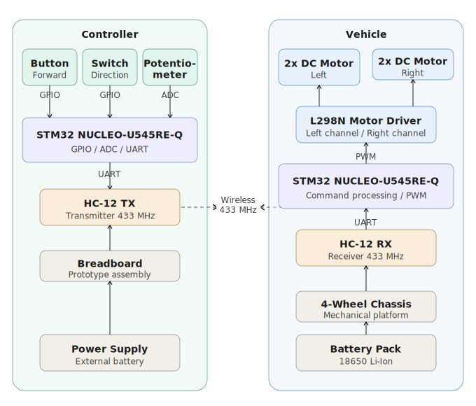

# RC Car

Remote controlled car using wireless serial communication.

:::info 

**Author**: Alex Mark Stan \
**GitHub Project Link**: https://github.com/UPB-PMRust-Students/acs-project-2026-MRK1717

:::

## Description

This project implements a wireless remote-controlled car using STM32 microcontrollers and HC-12 wireless communication modules.

The controller side is built on a breadboard and contains a push button used for forward movement, a reverse switch for changing the driving direction, and a potentiometer used for left/right steering control. These inputs are processed by the STM32 NUCLEO board and transmitted wirelessly through the HC-12 transmitter module using UART communication.

On the vehicle side, another HC-12 module receives the commands and forwards them to the motor control system. The motors are controlled through a motor driver connected to the 4-wheel chassis platform.

The system supports:
- forward movement;
- reverse movement;
- left/right steering;
- wireless real-time control.
## Motivation

I chose this project because it combines both hardware and software concepts, allowing me to learn about wireless communication, motor control, and processing analog inputs.

It is also a practical project that can be extended later with additional sensors or control features.

## Architecture 

The system is composed of two main subsystems:
- Controller side: breadboard inputs, STM32 NUCLEO board, and HC-12 transmitter module
- Car side: HC-12 receiver module, control board, motor driver, DC motors, and battery-powered chassis

The controller subsystem uses a push button for forward movement, a reverse switch for changing direction, and a potentiometer for steering control. These inputs are processed by the STM32 microcontroller and transmitted wirelessly through the HC-12 module using UART communication.

On the vehicle side, the received commands are processed by the control board, which drives the motor driver and controls the left and right motor channels accordingly.

## Log

### Week 20 - 24 April
Chose the project idea and analyzed the system architecture. Studied the components required for building the RC car, including the STM32 NUCLEO board, HC-12 module, and motor driver.

### Week 25 - 28 April
Researched communication between controller and car using the HC-12 module. Planned the hardware setup and started preparing the initial documentation.

## Hardware

Controller Subsystem:

The controller subsystem is built on a breadboard and contains:
- STM32 NUCLEO-U545RE-Q development board;
- HC-12 wireless transmitter module;
- push button used for forward movement;
- reverse direction switch;
- potentiometer used for left/right steering control;
- breadboard power rails and jumper wire connections.

The push button is used to trigger forward movement commands, 
while the potentiometer generates analog values used for steering control. 
The reverse switch changes the movement direction between forward and backward modes.

The STM32 reads these inputs using GPIO and ADC peripherals and transmits movement commands wirelessly through the HC-12 module using UART communication.

Vehicle Subsystem:

The vehicle subsystem contains:
- 4-wheel chassis platform;
- four DC motors;
- motor driver shield;
- HC-12 wireless receiver module;
- battery-powered motor control system.

The wireless commands received through the HC-12 module are processed by the control board, 
which drives the motors through the motor driver.

The motors are grouped into left and right channels in order to implement differential steering for turning movements.

The prototype is assembled using modular components, jumper wires, breadboard connections, 
and removable driver modules in order to simplify debugging and hardware testing during development.

### Schematics

### Bill of Materials

| Device | Usage | Price |
|--------|--------|-------|
| [STM32 Nucleo U545RE-Q](https://www.st.com/en/evaluation-tools/nucleo-u545re-q.html) | Main controller for processing inputs and wireless communication | [110 RON](https://ro.rsdelivers.com/product/stmicroelectronics/nucleo-u545re-q/stmicroelectronics-nucleo-u545re-q-stm32-nucleo/1899566) |
| [HC-12 Wireless Module](https://components101.com/wireless/hc-12-wireless-module) | Wireless UART communication between controller and vehicle | [2 x 20 RON](https://www.emag.ro/) |
| Breadboard | Prototype assembly for controller inputs | [15 RON](https://www.emag.ro/) |
| Push Button | Used for forward movement control | [5 RON](https://www.emag.ro/) |
| Toggle Switch | Used for reverse direction selection | [8 RON](https://www.emag.ro/) |
| Potentiometer | Used for left/right steering input | [10 RON](https://www.emag.ro/) |
| Motor Driver Shield / L298N Module | Controls the DC motors | [25 RON](https://www.emag.ro/) |
| [DC Motors](https://www.pololu.com/category/2/motors) | Vehicle movement system | [4 x 15 RON](https://www.emag.ro/) |
| Chassis Platform | Mechanical support for the RC car | [50 RON](https://www.emag.ro/) |
| Battery Pack | Power supply for motors and control system | [30 RON](https://www.emag.ro/) |
| Jumper Wires | Hardware interconnections | [10 RON](https://www.emag.ro/) |

## Software

| Library | Description | Usage |
|---------|-------------|-------|
| [STM32CubeMX](https://www.st.com/en/development-tools/stm32cubemx.html) | STM32 configuration tool | Used for GPIO, UART, ADC, and clock configuration |
| [embassy-stm32](https://github.com/embassy-rs/embassy/tree/main/embassy-stm32) | Hardware interface | Used as the base library for controlling STM32 peripherals |
| [embassy-time](https://github.com/embassy-rs/embassy) | Timing utilities | Used for delays and timing control |
| [embedded-hal](https://github.com/rust-embedded/embedded-hal) | Hardware abstraction traits | Used for portable embedded hardware interfaces |

## Links

1. https://components101.com/wireless/hc-12-wireless-module
2. https://components101.com/modules/l298n-motor-driver-module
3. https://www.st.com/en/evaluation-tools/nucleo-u545re-q.html
4. https://github.com/embassy-rs/embassy
5. https://www.st.com/en/development-tools/stm32cubemx.html
